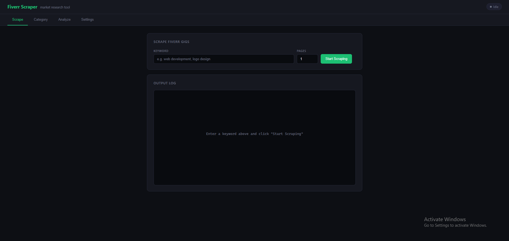

# Fiverr Scraper

A market research tool that scrapes Fiverr gig data by keyword search or category URL, extracts detailed gig information, and produces structured JSON output for analysis.



---

## How It Works

The tool routes all requests through **ScraperAPI** — a third-party proxy service that handles IP rotation and anti-bot bypassing so you never get blocked by Fiverr.

Each scrape job has two phases:

1. **Listing phase** — hits the search results or category page, extracts the list of gig URLs (up to 48 gigs per page)
2. **Detail phase** — visits each individual gig page and extracts the full data: packages, pricing, seller info, reviews, gallery, tags, FAQs

Data is saved as one JSON file per gig inside `gigs_data/`. After scraping, you can run the Analyze step to produce a single consolidated report with market statistics.

---

## Prerequisites

- **Python 3.8+** — [python.org/downloads](https://www.python.org/downloads/)
- **ScraperAPI key** (free tier: 5,000 requests/month) — [scraperapi.com](https://www.scraperapi.com)

---

## Setup on Windows

### Option A — Double-click launcher (easiest)

1. Clone or download and extract the project folder
2. Double-click **`launch.bat`**

The batch file will:
- Detect or create a Python virtual environment (`env/` or `venv/`)
- Install all dependencies automatically
- Open the web UI at `http://localhost:5000` in your browser

That's it. No terminal needed.

### Option B — Manual setup via CLI

```bat
cd fiverr-scraping-api

:: Create virtual environment
python -m venv env

:: Activate it
env\Scripts\activate

:: Install dependencies
pip install -r requirements.txt

:: Start the web server
python server.py
```

Then open `http://localhost:5000` in your browser.

---

## Web UI Usage

The UI has four tabs:

### Settings tab — do this first

Enter your **ScraperAPI key** and click **Save Key**. The key is stored in a local `.env` file and loaded automatically on every run.

### Scrape tab — keyword search

| Field | Description |
|---|---|
| Keyword | Any search term, e.g. `custom website development` |
| Pages | Number of result pages to scrape (1 page ≈ 48 gigs) |

Click **Start Scraping**. Logs stream live. When done, an **Open Folder** button appears pointing to the output directory.

### Category tab — category URL

Paste any Fiverr category page URL directly from your browser, for example:

```
https://www.fiverr.com/categories/programming-tech/website-development/custom-websites-development?source=category_filters
```

| Field | Description |
|---|---|
| Category URL | Full Fiverr category URL (filters in the URL are preserved) |
| Pages | Number of pages to scrape |

The scraper appends `&page=2`, `&page=3`, etc. automatically. Category pages show different gigs than keyword search results.

### Analyze tab

Select any previously scraped keyword or category folder from the dropdown and click **Analyze**. This produces a single consolidated JSON report in `keyword_analysis/` containing:

- Pricing statistics (average, min, max, median, price ranges)
- Seller level distribution
- Average ratings and review counts
- Delivery time stats
- Top 20 tags
- Full data for every scraped gig

---

## CLI Usage

You can also run scrapers directly without the web UI.

### Keyword scrape

```bat
:: Basic — scrape 1 page
python Fiverr_search-Scrapper.py "custom website development"

:: Multiple pages
python Fiverr_search-Scrapper.py "logo design" --pages 3

:: All options
python Fiverr_search-Scrapper.py "python automation" --pages 2 --key YOUR_KEY --delay 3 --output my_data
```

| Argument | Default | Description |
|---|---|---|
| `keyword` | required | Search term |
| `--pages` / `-p` | 1 | Pages to scrape |
| `--key` / `-k` | reads `.env` | ScraperAPI key |
| `--output` / `-o` | `gigs_data/` | Output directory |
| `--delay` / `-d` | 2 | Seconds between requests |

### Category scrape

```bat
:: Basic
python Fiverr_category-Scrapper.py "https://www.fiverr.com/categories/programming-tech/website-development/custom-websites-development?source=category_filters"

:: Multiple pages
python Fiverr_category-Scrapper.py "https://www.fiverr.com/categories/..." --pages 3

:: All options
python Fiverr_category-Scrapper.py "https://www.fiverr.com/categories/..." --pages 2 --key YOUR_KEY --delay 3
```

### Analyze

```bat
python analyze_keyword.py "gigs_data/custom website development"
```

Output: `keyword_analysis/custom website development_analysis.json`

---

## Output Structure

```
fiverr-scraping-api/
├── gigs_data/
│   ├── custom website development/       ← keyword scrape
│   │   ├── gig_123456_seller_name.json
│   │   └── ...
│   └── category_programming-tech_website-development_custom-websites-development/
│       ├── gig_789012_another_seller.json   ← category scrape
│       └── ...
└── keyword_analysis/
    └── custom website development_analysis.json   ← after Analyze step
```

Each gig JSON contains:

- `title`, `description`
- `seller_info` — username, level, rating, country, response time
- `packages` — Basic / Standard / Premium with prices, delivery days, features
- `pricing` — starting price, highest price, currency
- `reviews` — rating, count, breakdown, recent reviews
- `gallery` — images and videos
- `tags`, `metadata`, `faqs`
- `gig_info` — category, subcategory, nested subcategory, orders in queue

---

## Error Messages

| Banner | Meaning | Fix |
|---|---|---|
| Invalid or Missing API Key | ScraperAPI returned 401 | Check the key in Settings tab |
| ScraperAPI Quota Exceeded | ScraperAPI returned 403 — monthly limit hit | Upgrade plan or wait for billing cycle reset |
| ScraperAPI Rate Limit | Too many concurrent requests (429) | Increase the `--delay` value |
| No Gigs Found | 0 gigs returned from Fiverr | Check the keyword or URL is valid on Fiverr |

---

## Project Structure

```
fiverr-scraping-api/
├── server.py                      # Flask web server + UI backend
├── Fiverr_search-Scrapper.py      # Keyword scraper
├── Fiverr_category-Scrapper.py    # Category URL scraper
├── analyze_keyword.py             # Analysis and consolidation
├── discover_category_json.py      # Dev utility: inspect category page JSON
├── fiverr/
│   ├── __init__.py
│   └── utils/
│       ├── req.py                 # HTTP session + ScraperAPI integration
│       └── scrape_utils.py        # BeautifulSoup JSON extraction
├── templates/index.html           # Web UI
├── gigs_data/                     # Raw scraped gig files
├── keyword_analysis/              # Consolidated analysis reports
├── requirements.txt
├── launch.bat                     # Windows one-click launcher
└── .env                           # ScraperAPI key (create this yourself)
```

---

## Notes

- 1 page of results = ~48 gigs = ~49 ScraperAPI requests (1 listing page + 48 gig detail pages)
- The free ScraperAPI tier (5,000 req/month) covers roughly 100 gigs per month
- Scraping runs with a 2-second delay between requests by default to avoid rate limits
- All output is local — nothing is sent anywhere except to ScraperAPI for proxying
